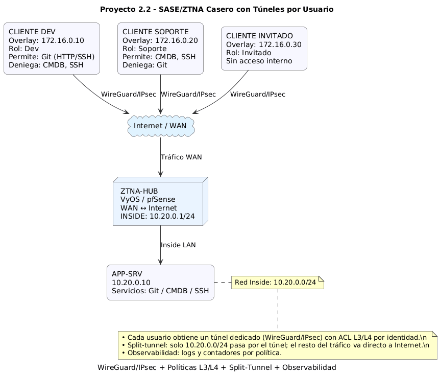

# 02 - Diseño y Topología

## Topología general

El entorno mínimo incluye 4–5 nodos:
- **ZTNA-HUB (VyOS/pfSense):**
  - WAN ↔ Internet (NAT)
  - INSIDE ↔ 10.20.0.0/24
- **APP-SRV (10.20.0.10):**
  - Simula servicios Git (HTTP/SSH), CMDB (HTTP), y SSH.
- **CLIENTE DEV, SOPORTE, INVITADO:**
  - Conectan desde Internet mediante túneles WireGuard/IPsec.

## Direccionamiento
| Componente | Interfaz | IP / Subred |
|-------------|-----------|--------------|
| HUB - Inside | eth1 | 10.20.0.1/24 |
| APP-SRV | eth0 | 10.20.0.10/24 |
| Overlay WG/IPsec | virtual | 172.16.0.0/24 |
| CLIENTE DEV | - | 172.16.0.10 |
| CLIENTE SOPORTE | - | 172.16.0.20 |
| CLIENTE INVITADO | - | 172.16.0.30 |

## Políticas L3/L4 esperadas
| Rol | Servicios permitidos | Denegados |
|------|-----------------------|------------|
| **Dev** | Git (HTTP/SSH) | CMDB, SSH |
| **Soporte** | CMDB (HTTP), SSH | Git |
| **Invitado** | Ninguno interno | Todo |

## Split-tunnel
Solo el tráfico hacia redes internas (10.20.0.0/24) pasará por el túnel.  
El tráfico a Internet se enruta directamente al ISP del cliente.

## Observabilidad
El hub debe registrar:
- Conexiones activas por usuario.
- Contadores de paquetes por política.
- Logs de aceptación/denegación en el firewall.

## Diagrama

